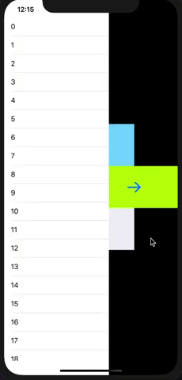

## **EasySideMenuController**

## Overview
This library can easily display a screen like a side menu.

## Demo


## Requirement
Swift 5.0

## Usage
1. The parent ViewController inherits from `EasySideMenuController` instead of `UIViewController`. At this time, please be sure to write `import EasySideMenuController`.

```swift
import UIKit
import EasySideMenuController

class ViewController: EasySideMenuController {

    override func viewDidLoad() {
        super.viewDidLoad()
    }
}
```

2. To display SideMenu from the parent ViewController, call the `SideMenuManager.shared.showSideMenu` method.
The following is a description of the arguments.

|argument|description|
|---|---|
|direction| You can choose from 4 options: .bottom, .top, .left, and .right.|
|presenting| Specify the parent ViewController. Basically there is no problem with `self`.|
|presented| Specify an instance of ViewController that you want to display.|
|sideMenuSize| Specify the display area of ​​ViewController instance specified by the above `presented` parameter.|

3. Make sure it works and works. You can display SideMenu in the above two steps.

This is an example of showing sideMenu at the left side.

```swift
import UIKit
import EasySideMenuController

class ViewController: EasySideMenuController {
    
    override func viewDidLoad() {
        super.viewDidLoad()
    }

    @IBAction func didTapLeftSideMenuButton() {
        let modalVC = UIStoryboard(name: "Left", bundle: nil).instantiateInitialViewController() as! LeftModalViewController
        SideMenuManager.shared.showSideMenu(
            direction: .left,
            presenting: self,
            presented: modalVC,
            sideMenuSize: CGSize(width: 250, height: UIScreen.main.bounds.height)
        )
    }
}
```

## Install
This library is compatible with **Cocoapods** only. Add `EasySideMenuController` to `Podfile` as follows and execute `pod install`.

```ruby
target 'TARGET_NAME_OF_YOUR_APP' do
  use_frameworks!
  pod 'EasySideMenuController'
end
```


## Contribution
If you find problems, improvements, or features that you want to add, please create an `issue` or` pull request`! waiting!

## Licence
[MIT](https://github.com/fummicc1/EasySideMenuController/blob/master/LICENSE)

## Author
<<<<<<< HEAD
[fummicc1](https://github.com/fummicc1)
>>>>>>> Stashed changes
=======
[fummicc1](https://github.com/fummicc1)
>>>>>>> 395f863be70b82824f50f16e2de8d7cbb321aee0
